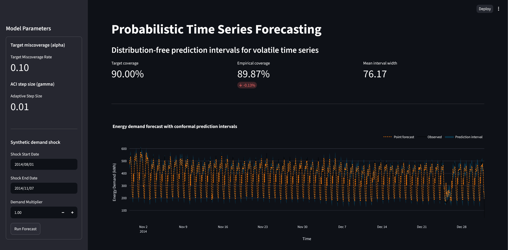

# Adaptive Conformal Forecasting

Distribution-free prediction intervals for volatile time series, with an adaptive layer that recalibrates as the series shifts regime.



## The problem

Sizing capacity or a hedge requires an interval, not a point forecast — and one whose stated coverage still holds at the time it is used.
Two obstacles. Split conformal prediction gives finite-sample coverage under exchangeability, which a demand series violates: the joint distribution is not permutation-invariant, because conditional variance is time-varying and residuals are serially dependent. And a correctly calibrated interval degrades after a regime shift — a heatwave, a network outage — under-covering until it is recalibrated, with no error signal to indicate that it has.
This project wraps a scikit-learn regressor in EnbPI (block-bootstrap conformal, built for sequential data) plus Adaptive Conformal Inference, which updates the effective miscoverage rate in response to realized coverage. The dashboard injects a synthetic demand shock so the adaptation path can be inspected directly.

Data: UCI electricity load (`LD2011_2014`), client MT_320, resampled hourly. MT_320 is used here as a high-volatility stress case, not a representative client — it stresses the interval width and adaptation speed, not average-case performance.

## Run it

```bash
uv sync --all-extras --dev && uv run streamlit run app/main.py
```

Or containerized:

```bash
docker build -t conformal-prediction-project . && docker run -p 8501:8501 conformal-prediction-project
```

With no local dataset or trained model present, the app bootstraps a synthetic demand series and an untuned RandomForest so it runs on a cold clone. The numbers below come from the real series — regenerate them with `uv run python scripts/compute_width_reduction.py` once `data/01_raw/LD2011_2014.txt` is in place.

## The result

On 1,500 held-out hours at a target of 90% coverage:

| | Empirical coverage | Mean interval width |
|---|---|---|
| Static conformal (γ = 0) | 92.7% | baseline |
| Adaptive (γ = 0.01) | 89.9% | 7.5% narrower |

The static baseline over-covers by 2.7 points, which is paid for in width: an interval wider than the target requires is a capacity margin held for no additional guarantee. The adaptive layer sits at the target and is 7.5% narrower.
Both numbers should be read at their resolution. At n = 1,500 and p = 0.9 the binomial SE on a coverage estimate is ≈0.8 pp, and serially dependent miscoverage events shrink the effective sample size further, so the true SE is larger. 89.9% is therefore indistinguishable from 90.0% — the informative result is the ≈3.6 SE separation from 92.7%, not the last decimal. The width comparison is also not made at matched coverage, so some fraction of the 7.5% is bought by covering 2.8 points less rather than by removing slack. Width at equal empirical coverage is the measurement that would settle it, and it has not been run.
Increasing γ for reactivity is not free. Sweeping γ ∈ {0.005, 0.01, 0.03, 0.05} against the real dataset gives width reductions of 10.9%, 7.5%, 3.8%, and −47% respectively. Above 0.03 the update overshoots after miscoverage events: coverage still tracks near the 90% target, but mean width inflates sharply, so the γ=0.05 arm is 47% *wider* than static despite acceptable coverage. The transition between 0.03 and 0.05 is unsampled, so its location is bounded by the grid, not measured — "somewhere in (0.03, 0.05)" is the honest statement, and calling it a cliff asserts a sharpness the four points do not establish.
Three limits on how far this sweep can be read:
- Reduction increases monotonically as γ falls across the sampled range, but it cannot do so in the limit: γ = 0 *is* the static baseline, where reduction is 0 by construction. The curve is therefore non-monotone with a maximum below 0.005 that this grid never locates.
- The sweep records width reduction without the coverage attained at each γ. Width reduction with unstated coverage is not comparable across arms, since any arm can narrow by covering less. Re-running the sweep with per-γ empirical coverage is required before any of these numbers rank the settings.
- Consequently γ = 0.01 is not established as optimal here. It is a judgment call favouring adaptation speed over the larger reduction measured at 0.005, and the sweep as run does not support a stronger claim.
The sweep was also run against the same 1,500-hour held-out window the results above are reported on, so the reported width reduction is optimistically biased by selection on the test set. A three-way split (train / validation for the γ sweep / test for reported numbers only) is the correct structural fix and the first thing I'd change.

**ACI update granularity (fixed).** The Gibbs & Candès (2021) recursion is `α_{t+1} = α_t + γ (α − err_t)`, with `err_t = 1{y_t ∉ C_t(α_t)}` evaluated per timestep. The first working version applied it once per 168-hour prediction chunk against the chunk's aggregate error rate — a coarse approximation, roughly two orders of magnitude less reactive than the recursion specifies. `err_t` is now evaluated per timestep and the α trajectory follows the recursion.

Note on the two "step sizes": γ is the step size in the paper's sense. The `step_size` config key is the *batching interval* (default 168) controlling how often the emitted interval is refreshed, and it is unrelated to γ. Renaming it to `refresh_interval` is pending.

The emitted band is piecewise-constant over `refresh_interval` steps while the α path is per-step, so the interval shown is a downsampled view of the α trajectory rather than a per-step band. `step_size=1` makes the two coincide.
The batching is real compute savings, not just presentation: `predict()` is called once per chunk on the full `X_chunk` (one vectorized MAPIE call per 168 steps rather than 168), and `update()` is likewise called once per chunk. The per-step `err_t` loop that drives the α recursion runs over the already-computed `chunk_lower`/`chunk_upper` arrays in memory and issues no further model calls. `step_size=1` would force 168 separate `predict`/`update` calls per chunk instead of one.

## What I'd do differently

- **Write the reference formula as a test first.** The ACI bug produced plausible-looking output and valid bounds — nothing crashed, coverage was in the right neighborhood. It was only visible against the paper's update rule. For anything implementing a published estimator, the paper's equation should become an assertion before the code exists.
- **Move to Conformalized Quantile Regression.** EnbPI on absolute residuals yields symmetric intervals. Electricity demand is visibly heteroscedastic, so symmetric bands are too wide on one side and too tight on the other. CQR gives asymmetric, variance-aware intervals at the same guarantee.
- **Get inference out of the Streamlit thread.** It currently runs synchronously in the presentation layer, guarded by a deep copy of the cached conformity scores, with a hard 1,500-row cap to stop memory from blowing up. That cap is a symptom. The right shape is a stateless inference service the UI calls.
- **Revisit the imputation.** Gaps are forward-filled because time-based interpolation leaked future values into the calibration set. LOCF is the safe choice, not the accurate one — flagging gap-filled hours and excluding them from calibration would be better than pretending they're observations.

## Stack

Python 3.12 · MAPIE · scikit-learn · pandas · NumPy · Plotly · Streamlit · uv · Docker · Pytest · Ruff · mypy

## Layout

```
Ingestion (data_processing.py) → feature engineering (lags, rolling stats)
  → base model training (model_training.py, TimeSeriesSplit CV)
  → conformal calibration (conformal_engine.py — EnbPI + per-timestep ACI)
  → Streamlit UI with live coverage metrics and shock simulator
```

| Path | Purpose |
|---|---|
| `src/data_processing.py` | Ingestion, resampling, LOCF imputation, feature extraction |
| `src/model_training.py` | Base regressor training and hyperparameter search |
| `src/conformal_engine.py` | EnbPI calibration, per-timestep ACI inference |
| `src/config.py` | Centralized hyperparameter loading (`config/hyperparameters.yaml`) |
| `app/` | Streamlit UI, controls, Plotly visualizations |
| `tests/` | Conformal math and data-integrity regression tests |
| `scripts/validate_pipeline.ps1` | End-to-end smoke test: install → tests → lint → Docker build → container health check. PowerShell, Windows-only; no Bash equivalent yet. Asserts container liveness, not a prediction response. |

Hyperparameters (`alpha`, `gamma`, bootstrap block count) live in YAML and are loaded through one accessor, so tuning never touches application code.