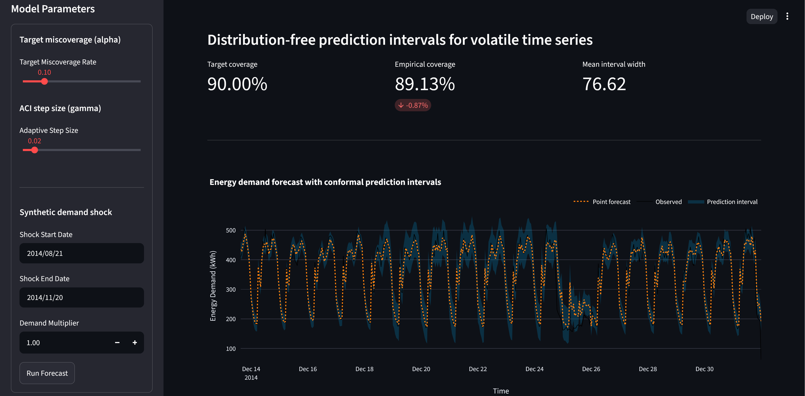

# Adaptive Conformal Forecasting

Distribution-free prediction intervals for volatile time series, with an adaptive layer that recalibrates as the series shifts regime.



## The problem

A point forecast of electricity demand is not something you can size capacity or a hedge against. What a planner needs is a range with a coverage guarantee — and one that doesn't quietly stop being true.

Two things make that hard. Standard conformal prediction guarantees coverage under exchangeability, which time series violate by construction: yesterday's residual predicts today's. And even a correctly calibrated interval goes stale after a regime shift — a heatwave, an outage, a price shock — silently under-covering for weeks before anyone notices.

This project wraps any scikit-learn regressor in EnbPI (block-bootstrap conformal, built for sequential data) plus Adaptive Conformal Inference, which adjusts the effective miscoverage rate at every timestep in response to realized coverage. The dashboard lets you inject a synthetic demand shock and watch the bands react.

Data: UCI electricity load (`LD2011_2014`), client MT_320, resampled hourly. MT_320 is used here as a high-volatility stress case, not a representative client — it stresses the interval width and adaptation speed, not average-case performance.

## Run it

```bash
uv sync --all-extras --dev && uv run streamlit run app/main.py
```

Or containerized:

```bash
docker build -t conformal-prediction-project . && docker run -p 8501:8501 conformal-prediction-project
```

With no local dataset or trained model present, the app bootstraps a synthetic demand series and an untuned RandomForest so it runs on a cold clone. The numbers below come from the real series — regenerate them with `uv run python scripts/compute_width_reduction.py` once `data/01_raw/LD2011_2014.txt` is in place.

## The result

On 1,500 held-out hours at a target of 90% coverage:

| | Empirical coverage | Mean interval width |
|---|---|---|
| Static conformal (γ = 0) | 92.7% | baseline |
| Adaptive (γ = 0.01) | 89.9% | 7.5% narrower |

The static baseline over-covers by 2.7 points. That sounds harmless, but over-coverage is paid for in width — an interval wider than it needs to be is a capacity decision that costs money for no added safety. The adaptive layer tracks the target to within 0.1 points and buys back that width.

Gamma isn't free to increase for more reactivity, though: sweeping it against the real dataset shows a stability cliff. Below ~0.03, width reduction is positive and grows as gamma shrinks (10.9% at γ=0.005, 7.5% at γ=0.01). Above ~0.03, the update starts overshooting after miscoverage events — coverage still tracks near the 90% target, but mean width inflates sharply (a γ=0.05 run that looked promising on coverage alone actually produced 47% *wider* intervals than static). γ = 0.01 was chosen as the default after this sweep, trading a slightly lower peak reduction for a stable operating point. This sweep was run against the same 1,500-hour held-out window the results above are reported on, so the reported width reduction is optimistically biased by selection on the test set. A three-way split (train / validation for the γ sweep / test for reported numbers only) is the correct structural fix and the first thing I'd change.

**The bug that made this real.** The first working version applied the ACI update once per 168-hour prediction chunk, using the chunk's aggregate error rate. That is not Adaptive Conformal Inference — it's a coarse approximation of it, and at a step size of 168 the adaptation was roughly two orders of magnitude less reactive than the Gibbs & Candès (2021) formulation intends. The alpha trajectory now follows Gibbs & Candès exactly. Predictions remain batched per chunk for latency, so the emitted interval width still refreshes once per `step_size` steps — the alpha path is correct, the band resolution is a compute trade-off, and setting `step_size=1` recovers full online behaviour at higher cost.

## What I'd do differently

- **Write the reference formula as a test first.** The ACI bug produced plausible-looking output and valid bounds — nothing crashed, coverage was in the right neighborhood. It was only visible against the paper's update rule. For anything implementing a published estimator, the paper's equation should become an assertion before the code exists.
- **Move to Conformalized Quantile Regression.** EnbPI on absolute residuals yields symmetric intervals. Electricity demand is visibly heteroscedastic, so symmetric bands are too wide on one side and too tight on the other. CQR gives asymmetric, variance-aware intervals at the same guarantee.
- **Get inference out of the Streamlit thread.** It currently runs synchronously in the presentation layer, guarded by a deep copy of the cached conformity scores, with a hard 1,500-row cap to stop memory from blowing up. That cap is a symptom. The right shape is a stateless inference service the UI calls.
- **Revisit the imputation.** Gaps are forward-filled because time-based interpolation leaked future values into the calibration set. LOCF is the safe choice, not the accurate one — flagging gap-filled hours and excluding them from calibration would be better than pretending they're observations.

## Stack

Python 3.12 · MAPIE · scikit-learn · pandas · NumPy · Plotly · Streamlit · uv · Docker · Pytest · Ruff · mypy

## Layout

```
Ingestion (data_processing.py) → feature engineering (lags, rolling stats)
  → base model training (model_training.py, TimeSeriesSplit CV)
  → conformal calibration (conformal_engine.py — EnbPI + per-timestep ACI)
  → Streamlit UI with live coverage metrics and shock simulator
```

| Path | Purpose |
|---|---|
| `src/data_processing.py` | Ingestion, resampling, LOCF imputation, feature extraction |
| `src/model_training.py` | Base regressor training and hyperparameter search |
| `src/conformal_engine.py` | EnbPI calibration, per-timestep ACI inference |
| `src/config.py` | Centralized hyperparameter loading (`config/hyperparameters.yaml`) |
| `app/` | Streamlit UI, controls, Plotly visualizations |
| `tests/` | Conformal math and data-integrity regression tests |
| `scripts/validate_pipeline.ps1` | End-to-end smoke test: install → tests → lint → Docker build → health check |

Hyperparameters (`alpha`, `gamma`, bootstrap block count) live in YAML and are loaded through one accessor, so tuning never touches application code.